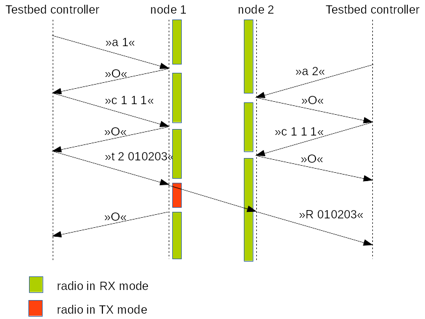

.. vim:sw=3 ts=3 expandtab tw=78

Firmware interface
==================

In VESNA implementation of the SpectrumWars game, one or more sensor nodes are
connected to the game controller (e.g. a Linux running computer) with a
RS-232 serial line (USART1 interface on the sensor node, set to 115200 baud).
Typically a serial-to-USB converter is employed.

The testbed controller controls the sensor node using a terse, ASCII base
protocol. Commands are kept short to keep the protocol reasonably fast even
when used over a relatively slow serial line. ASCII has been chosen over a
binary protocol to aid in debugging (i.e. the node can be controlled manually
using a standard serial terminal for development and debugging purposes)

Protocol consists of atomic messages: commands (sent from the controller to
the node) and responses (sent from the node to the controller). Each message
starts with a unique ASCII alphabet character denoting the type of the
message, has optional space separated parameters and ends with ASCII line
feed character ("\\n").

Following commands can be sent from the controller to the node:

a *<address>*
   Set the radio address. *<address>* is a hexadecimal integer in the range
   0-255 containing the MAC address. Node will only receive packets addressed
   at the configured MAC address and will silently ignore others.

c *<chan>* *<bw>* *<power>*
   Set the radio channel, bandwidth and power. Parameters are hexadecimal
   integers with the following meanigs:

   *<chan>* radio frequency channel to tune to. Valid channels are from 0 to
   255. Central frequency is calculated using the following formula::

      f = 2400.0 MHz + <chan> * 0.1 MHz

   *<bw>* channel bandwidth setting to use, starting with 0. This setting
   affects the channel filter and modem bitrate according to the following
   table:

   ======  ==============  ====================
   *<bw>*  bitrate [kbps]  channel filter [kHz]
   ======  ==============  ====================
   0       50              100
   1       100             200
   2       200             400
   3       400             800
   ======  ==============  ====================

   *<power>* power amplifier setting to use, starting with 0. This setting
   affects the transmission power according to the following table:

   =========  ====================
   *<power>*  transmit power [dBm]
   =========  ====================
   0          0
   1          -2
   2          -4
   3          -6
   4          -8
   5          -10
   6          -12
   7          -14
   8          -16
   9          -18
   10         -20
   11         -22
   12         -24
   13         -26
   14         -28
   15         -30
   16         < -55
   =========  ====================

   Regardless of the settings, `minimum-shift keying
   <https://en.wikipedia.org/wiki/Minimum-shift_keying>`_ modulation is used.

t *<address>* *<data>*
   Transmit a packet using the previously set radio parameters.

   *<address>* is a hexadecimal integer in the range 0-255 containing the MAC
   address of the recipient.

   *<data>* is a hexadecimal string containing the data to be transmitted in
   the packet. Two hexadecimal digits per byte. The length of the string can
   be between 1 and 252 bytes.

   For example, sending packet with ASCII content "hello" to address 1::

      t 01 68656c6c6f

Node can respond with the following responses:

O
   Last command was successfully executed.

E *<message>*
    Last command resulted in error. *<message>* is an ASCII string describing the error.

R *<data>*
   Node received a packet. *<data>* is a hexadecimal string containing the
   data in the packet.

   Radio does CRC checking in hardware and silently drops corrupted packets.
   Hence it is very likely that the *<data>* string is identical to the one
   passed to the corresponding *t* command.

Any messages not conforming to this response format should be ignored by the
controller.

By default, the node’s radio is kept in receive mode. Receive mode is
temporarily turned off during reconfiguration. After receiving a transmit
command, the node switches the radio to transmit mode, transmits the single
packet and switches back to receive mode.

