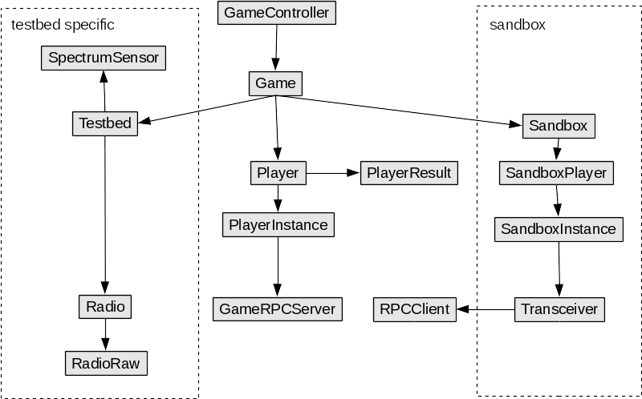

.. vim:sw=3 ts=3 expandtab tw=78

Implementation notes
====================

* USRP spectrum sensing is inspired by a real-time signal analyzer. e.g. we do
  continuous end-to-end FFTs with no blind time for all received samples. The
  spectral density is then averaged over a window of 200 ms. This is the main
  reason why sensing is very CPU intensive and we can't sense more than 64
  channels (even if USRP frontend bandwidth would allow for more).

  Sensing in this way is necessary because the radios have a very low duty
  cycle (e.g. a "while True: send()" has only around 10% duty cycle). If we
  would only take one sample the spectrum when players request it, it would
  mostly appear empty. Hence the need to take a moving average if sensing is to
  be useful for detecting transmissions.

* The corrolary of the above is that even 64 channels is a very generous
  portion of the spectrum for this game. A single channel could in theory
  accomodate 10 players with very little interferrence.

* Currently, ``spectrumwars_runner`` runs player's code in a separate
  processes (provided by ``spectrumwars_sandbox`` executable). The processes
  communicate through ZeroMQ JSON RPC. This provides some isolation between
  players and the game controller. It prevents simple ways of cheating that
  would be possible if code would share the same Python interpreter. It also
  gracefully handles infinite loops and most accidental errors.

  This is not, however, robust against more sophisticated malicious code.
  There is currently nothing preventing one user from accessing the RPC
  interface inteded for another user. There is also nothing preventing
  player's code from accessing the network, filesystem or consuming excessive
  amounts of memory. These limitations must be implemented on the operating
  system level and current code makes no attempt to implement them.

  In the future, more sophisticated sandbox methods might be implemented (e.g.
  running player's code in a virtual host). Since all communication between
  player's code in ``Transceiver`` class and the game controller already
  occurs over RPC, this should not require further modifications to the game
  controller.

* Using sensor nodes connected directly over USB (instead of using
  serial-to-USB converters) greatly simplifies the setup - apart from a
  powered USB hub, there is no need for having a converter plus a separate
  power supply for each node.

  However, USB CDC implementation on VESNA is still prone to occasional data
  loss. This is visible as errors in communication between the game controller
  and the radio (e.g. ``RadioTimeout`` exceptions or truncated packet
  payload). At the moment this is rare enough for direct USB connection
  to be considered usable in practice.

* I believe that in the final user interface for this game, it is crucial that
  both console log of the running game and the visualized timeline are
  presented to each player. Without this kind of feedback it is very hard to
  develop a working algorith.

* There is no concept of radio power usage, battery level, etc. as discussed in
  the original design document. I believe these are unnecessary complications
  and in any case would only be simulated since radios always run on external
  power. If the aim is to encourage players to conserve power, this can be
  achieved with appropriate scoring function (e.g. give negative score for
  excessive number of transmitted packets or high transmission power)

* There is no scoring function defined at the moment.

* There is no backchannel communication between the player's classes
  implemented. I believe this is an unnecessary complication and current
  experience shows that it is quite simple to use data in the packet to
  communicate between the nodes. This is also a more realistic scenario.
