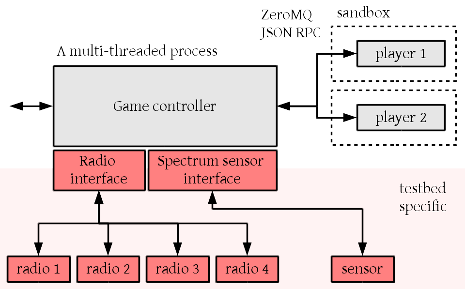

.. vim:sw=3 ts=3 expandtab tw=78

#################
Developer's Guide
#################

This part of the documentation covers parts that are interesting for testbed
operators wanting to add support for their hardware to SpectrumWars,
administrators wanting to deploy SpectrumWars on their testbed and
SpectrumWars developers.

.. toctree::
   :maxdepth: 2

   install
   installtestbed
   firmware
   testbed
   implementation
