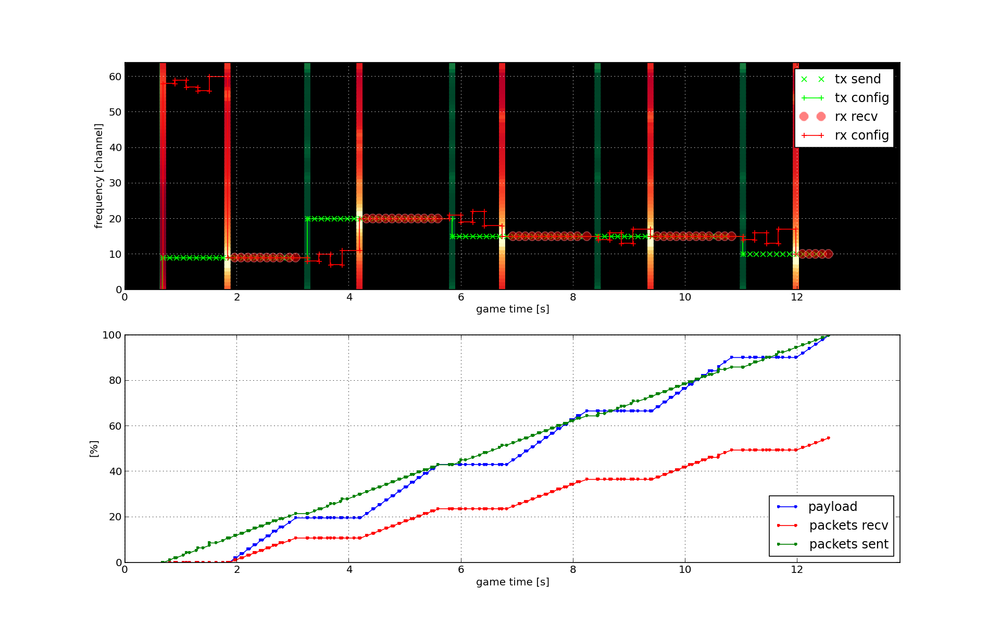

.. vim:sw=3 ts=3 expandtab tw=78

Running examples
================

To run a game with a single player that is specified by code in
``examples/better_cognitive.py``::

   $ spectrumwars_runner -l example.log examples/better_cognitive.py

You can add more players to the game by specifying more Python files to the
command line.

By default ``spectrumwars_runner`` uses a simulated testbed that does not
require any special hardware. You can specify the testbed to use using the
``-t`` command line argument. For example, to run the game using the VESNA
testbed, use::

   $ spectrumwars_runner -t vesna -l example.log examples/better_cognitive.py

In this case, ``spectrumwars_runner`` automatically finds any USB-connected
VESNA nodes and assigns them randomly to players.

.. note::
   As of 0.0.3, ``spectrumwars_runner`` no longer uses VESNA nodes connected
   over serial-to-USB converters.

While the game is running, you will see some debugging information on the
console. In the end, some game statistics are printed out::

   Results:
   Player 1:
       crashed             : False
       transmitted packets : 93
       received packets    : 51 (45% packet loss)
       transferred payload : 12801 bytes (avg 981.4 bytes/s)

   Game time: 13.0 seconds

If player code raised an unhandled exception at some point you will also see a
backtrace. This should assist you in debugging the problem.

In addition to the ASCII log that is printed on the console, the game also
saves a binary log file to ``example.log``. The binary log contains useful
debugging information about events that occurred during the game. You can
visualize the log by running::

   $ spectrumwars_plot -o example.out example.log

This creates a directory ``example.out`` with a few images in it. One
visualization is created for each player participating in the game. These are
named ``player0.png``, ``player1.png`` and so on, using the same order as it
was used on the ``spectrumwars_runner`` command line. One additional
visualization named ``game.png`` is created showing the overall progress of
the game.

Understanding the visualizations
--------------------------------

For the example above, ``player0.png`` should look something like this:

The upper graph with the black background shows the progress of the game in a
time-frequency diagram. Game time is on the horizontal axis and frequency
channels are on the vertical. Key events in the game are displayed in this diagram
with the focus on the current player.

 * Red color marks events related to this player's ``Receiver`` class,
 * green color marks events related to this player's ``Transmitter`` class and
 * gray color marks events related to other player's transceivers.

Since only one player participated in this game, there are no gray color
markers on the diagram shown above. The behavior of the single player can be
seen from the following markers:

 * Green crosses show transmitted packets from the player's ``Transmitter``
   class. These correspond to calls to the ``send()`` method.

 * Red circles show packets, that were successfully received by the player's
   ``Receiver`` class.

 * Thick green and red vertical lines show spectral scans by the transmitter
   and receiver respectively. These correspond  to calls to the
   ``get_status()`` method, or when the ``status_update()`` event happens. The
   lines vary slightly in color to show the result of the spectral scan -
   lighter color means a higher detected signal level on the
   corresponding channel.

 * The small crosses connected with a thin green and vertical lines show the
   currently tuned frequency of the transmitter and receiver respectively. The
   lines shift in frequency for each call to the ``set_configuration()``
   method.

.. note::
   Only packet transmissions are shown for other players.

Reading the specific diagram above, you can see that the transmitter first
started transmitting near channel 10. After around 3 seconds, it performed a
spectral scan and shifted the frequency to channel 20. The receiver on the
other hand, attempted first to unsuccessfully receive packets around channel
60. Then it performed a spectral scan at around 2 second mark. After the scan
it tuned to the transmitter's channel and started to successfully receive
packets. This continued until the transmitted jumped to channel 20, after which
the receiver started changing channels again in an attempt to restore packet
reception.

The bottom graph shows progress of some performance indicators: percentage of
transferred payload, transmitted and received packets. These are relative to
the total payload and packet counts in the game.

The ``game.png`` show look something like this:

.. image:: figures/example_game.png
   :width: 100%
   :align: center

Similar to the upper graph in the per-player visualization, this graph shows a
time-frequency diagram. The color on the diagram shows signal level, as
reported by the actual spectrum sensor, for each channel and moment in time while the
game was running.

The color bar on the right shows the mapping between the color and the
specific value that would be seen by player code at that time and channel if
it called the ``get_status()`` method.

Exact time and frequency of packet transmissions of all players in the game
are shown superimposed over the diagram using small white crosses.
