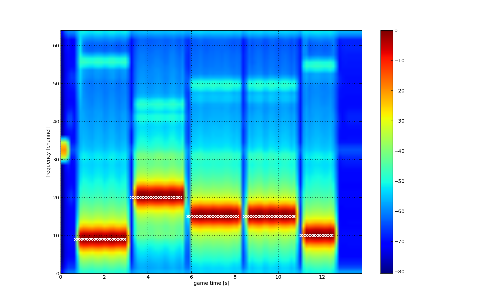

.. vim:sw=3 ts=3 expandtab tw=78

Running examples
================

To run a game with a single player that is specified by code in
``examples/better_cognitive.py``::

   $ spectrumwars_runner -l example.log examples/better_cognitive.py

``spectrumwars_runner`` automatically finds any connected nodes (it
assumes that all USB-to-serial devices are in fact connected to VESNA nodes)
and assigns them to players.

In the end, it prints out some game statistics::

   Results:
   Player 1:
       crashed             : False
       transmitted packets : 95
       received packets    : 51 (54%)
       transferred payload : 12801 bytes (avg 1099.6 bytes/s)
   Game time: 11.6 seconds

It also saves a binary log file to ``example.log``. In addition to the ASCII
log that is printed on the console, the binary log contains useful debugging
information about events that occurred during the game. You can visualize the
log by running::

   $ spectrumwars_plot -o example.out example.log

This creates a directory ``example.out`` with one image per player. For
the example above, ``example.out/player0.png`` should look something like
this:

Red markers are events from the ``Receiver`` class. Circles show successfully
received packets. Crosses show radio reconfigurations (i.e.
``set_configuration()`` method calls). Horizontal lines show spectral scans. A
scan is shown each time the class requests it using ``get_status()`` method or
when the ``status_update()`` event happens.

Similarly, green markers are events from the ``Transmitter`` class. Crosses
again show radio reconfigurations while exes show packet transmissions.
