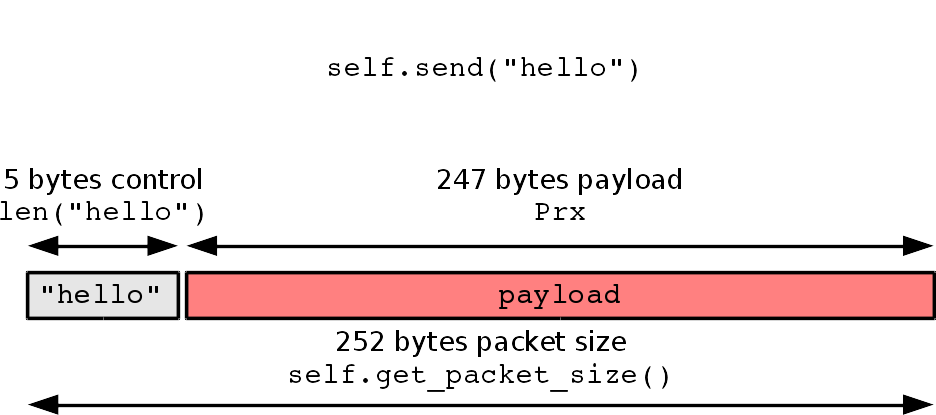

.. vim:sw=3 ts=3 expandtab tw=78

Scoring
=======

At the moment, SpectrumWars doesn't use a single scoring function. Players may
be ranked by different criteria, depending on a specific competition. Game
controller currently records the following statistics for each player in
a game:

**Packet loss**
   Packet loss is defined as::

      _    Ntx - Nrx
      PL = ---------
              Ntx

   Where ``Ntx`` is the total number of packets transmitted by the player's
   transmitter during the game and ``Nrx`` is the total number of packets
   received by the player's receiver during the game.

   Note that packets with control data in the direction from the *receiver*
   to the *transmitter* do not count.

**Throughput**
   Throughput is defined as::

      _     Prx    bytes
      TP = ----- [ ----- ]
             T       s

   Where ``Prx`` is the total amount of payload data received by the player's
   receiver in bytes and ``T`` is the duration of the game in seconds.

